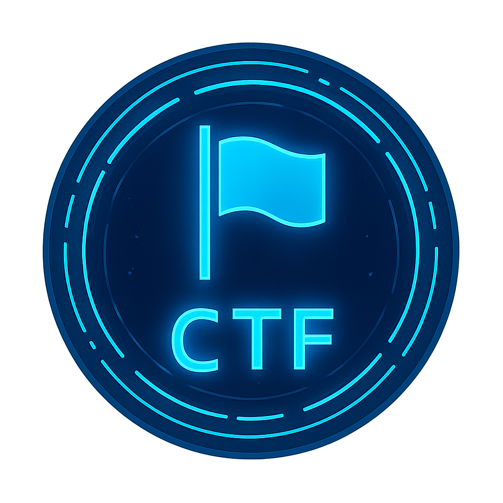

  
  
  <h1>Lcram33 / Marc L.</h1>

Ingénieur en sécurité informatique / Cybersecurity engineer 🛡️

|  |  |
|:--:|:--:|
| LK | Blog |

## CTFs

 
  
  &nbsp;&nbsp;
  

## Collections d'outils

|  |  |
|:--:|:--:|
| Privacy center 👻 | OSINT ToolBox 🔨 |

## Projets personnels & académiques

|  |  |
|:--:|:--:|
| VM CTF | PoC docker bastion guacamole |

## Homelab

*Ce que j'ai déployé chez moi*

 
  
  &nbsp;&nbsp;
  
  &nbsp;&nbsp;
  
  &nbsp;&nbsp;
  
  &nbsp;&nbsp;
  
  &nbsp;&nbsp;
  
  &nbsp;&nbsp;
  

## Coding

 
  
  
  &nbsp;&nbsp;
  

## Github stuff

Cliquer pour développer

  

&nbsp;
  

  

-----

## Credits:

Cliquer pour développer

* <a href="https://www.flaticon.com/free-icons/logo" title="logo icons">Logo icons created by Freepik - Flaticon</a>
* [PowerShell logo](https://debugandrelease.blogspot.com/2018/11/deleting-old-files-with-powershell.html)
* <a target="_blank" href="https://icons8.com/icon/TMZAZMLFozcL/bash">Bash</a> icon by <a target="_blank" href="https://icons8.com">Icons8</a>

